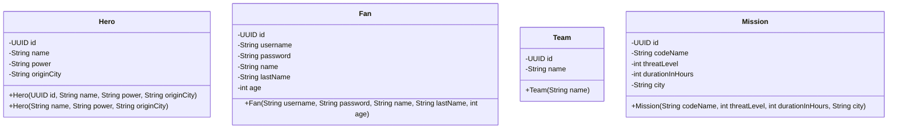

# Proyecto - HeroHub: La Agencia de Superhéroes

La ciudad necesita héroes. Los héroes necesitan misiones. Y las misiones... necesitan papeleo.

**HeroHub** es la agencia encargada de gestionar a los superhéroes de la ciudad: registrar sus poderes, asignar misiones, organizar equipos y mantener contentos a sus fanáticos. Ustedes han sido contratados como el equipo de desarrollo de la agencia. Su trabajo es construir el sistema de gestión interno de HeroHub.

Este proyecto **crece iteración tras iteración** con los temas que se ven en clase. Este documento define por completo la primera iteración y, para cada una de las siguientes, le dice **qué resultado debe lograr el programa** (ver la [hoja de ruta](#hoja-de-ruta-del-proyecto)). Las reglas detalladas de cada iteración (por ejemplo, los mensajes exactos de error) las entrega el profesor en el taller de esa iteración, y **serán ustedes quienes propongan cómo diseñar el software** para lograr el resultado: qué clases, qué capas y qué archivos utilizar. El diseño se defiende en el aula.

## Índice

- [Proyecto - HeroHub: La Agencia de Superhéroes](#proyecto---herohub-la-agencia-de-superhéroes)
  - [Índice](#índice)
  - [La visión: gestión de héroes y planificación estratégica](#la-visión-gestión-de-héroes-y-planificación-estratégica)
  - [¿Cómo se trabajará en este proyecto?](#cómo-se-trabajará-en-este-proyecto)
  - [Iteración 1 - Semana 9: Primeros pasos en HeroHub](#iteración-1---semana-9-primeros-pasos-en-herohub)
    - [Enunciado](#enunciado)
      - [Paquetes](#paquetes)
        - [Paquete model](#paquete-model)
        - [Clase `Hero`:](#clase-hero)
          - [Atributos](#atributos)
          - [Constructores](#constructores)
        - [Clase `Fan`](#clase-fan)
          - [Atributos](#atributos-1)
          - [Constructores](#constructores-1)
        - [Clase `Team`](#clase-team)
          - [Atributos](#atributos-2)
          - [Constructores](#constructores-2)
        - [Clase `Mission`](#clase-mission)
          - [Atributos](#atributos-3)
          - [Constructores](#constructores-3)
    - [Clases sin paquete](#clases-sin-paquete)
      - [Clase `Main`](#clase-main)
    - [Diagrama de clases inicial](#diagrama-de-clases-inicial)
    - [Verificación de la entrega](#verificación-de-la-entrega)
    - [Calificación de la iteración 1](#calificación-de-la-iteración-1)
  - [Iteración 2 - Proyecto base](#iteración-2---proyecto-base)
  - [La librería de la Agencia](#la-librería-de-la-agencia)
    - [Paso 1: agregar la librería al proyecto](#paso-1-agregar-la-librería-al-proyecto)
    - [Paso 2: recibir y configurar el token](#paso-2-recibir-y-configurar-el-token)
    - [Paso 3: comprobar que funciona](#paso-3-comprobar-que-funciona)
  - [Hoja de ruta del proyecto](#hoja-de-ruta-del-proyecto)
    - [Iteración 2 - Relaciones entre clases y responsabilidad única](#iteración-2---relaciones-entre-clases-y-responsabilidad-única)
    - [Iteración 3 - Strings y excepciones: el fanático y la Agencia Central](#iteración-3---strings-y-excepciones-el-fanático-y-la-agencia-central)
    - [Iteración 4 - Archivos de texto y binarios: cargar y guardar la partida](#iteración-4---archivos-de-texto-y-binarios-cargar-y-guardar-la-partida)
    - [Iteración 5 - Herencia y polimorfismo: el juego de despacho](#iteración-5---herencia-y-polimorfismo-el-juego-de-despacho)
  - [Calificación general](#calificación-general)
  - [Preguntas frecuentes (FAQs)](#preguntas-frecuentes-faqs)
  - [Recursos en línea](#recursos-en-línea)

## La visión: gestión de héroes y planificación estratégica

El sistema que construirán está inspirado en el minijuego de despacho del videojuego _Dispatch_: un segmento centrado en la gestión donde se asignan superhéroes a misiones con base en sus habilidades y estadísticas, equilibrando las probabilidades de éxito, la disponibilidad y los tiempos de recuperación.

Un aspecto clave del sistema es equilibrar la disponibilidad de los héroes y seleccionar la combinación correcta de habilidades. Los héroes tienen fortalezas distintas, y algunas misiones son más desafiantes que otras, lo que exige un uso creativo de sus capacidades. Las estadísticas ocultas, como la **sinergia del equipo**, añaden otra capa de complejidad: recompensan a quienes experimentan con diferentes combinaciones y se adaptan a los requisitos cambiantes de cada misión.

En definitiva, el despacho de misiones de HeroHub combina la toma de decisiones tácticas con la gestión estratégica: no basta con tener héroes poderosos, hay que saber **a quién enviar, con quién y cuándo**.

Esta sección describe la _visión_ del producto, no el detalle de cada iteración. La [hoja de ruta](#hoja-de-ruta-del-proyecto) explica cómo se llega a esa visión paso a paso: primero se gestionan héroes, equipos, misiones y fanáticos; luego se validan y se conectan con la Agencia Central; después se guarda y se reanuda el estado; y al final las misiones se despachan, con estadísticas, sinergia y consecuencias. Cómo se diseña cada pieza es una decisión que los equipos propondrán y defenderán a lo largo de las iteraciones.

[Volver al índice](#índice)

## ¿Cómo se trabajará en este proyecto?

El proyecto se desarrolla en **iteraciones** que coinciden con los temas del curso. La iteración 1 está completamente definida en este documento. Para las demás, la [hoja de ruta](#hoja-de-ruta-del-proyecto) describe el **resultado esperado** y la dinámica de cada semana es la siguiente:

1. **Lunes: propuesta de diseño, de alto nivel.** Cada equipo entrega una propuesta corta que explica, como mínimo:
    - Qué clases nuevas necesita el sistema y cómo cambian las existentes.
    - Cómo se relacionan y en qué capa vive cada responsabilidad.
    - El diagrama de clases actualizado (puede usar [mermaid](https://mermaid.js.org/syntax/classDiagram.html) o [plantuml](https://plantuml.com/class-diagram)).
2. **Miércoles: taller en clase.** El profesor da retroalimentación sobre las propuestas, entrega las reglas detalladas de la iteración y, cuando corresponde, el código base. Durante el taller cada equipo construye y entrega la primera parte de la iteración.
3. **Miércoles siguiente: entrega completa.** El equipo termina el resto en casa y presenta el programa funcionando.

**Las dos partes se verifican en persona, en clase**, con el equipo ejecutando su programa. Un integrante ausente en la verificación obtiene 0.0 en esa parte, salvo excusa válida, y la primera parte no se recibe después del taller.

> [!WARNING]
> Este proyecto hace parte de su nota final. Las funcionalidades incompletas de una iteración deberán corregirse, pero no impedirán que el equipo continúe con los conceptos de la siguiente. La corrección se evaluará por separado.

[Volver al índice](#índice)

## Iteración 1 - Semana 9: Primeros pasos en HeroHub

### Enunciado

A continuación se presenta la documentación de la primera iteración del sistema de HeroHub. Va a encontrar una explicación detallada de las clases que deben existir en el proyecto.

El primer paso es descargar o clonar el proyecto de este repositorio. Luego, abrirlo en un IDE (preferiblemente IntelliJ) y empezar a trabajar en él. Recuerde que debe tener instalado Java 25.

Una vez que haya abierto el proyecto, se crearán las clases necesarias para trabajar en el proyecto. Cada una de estas clases deberá estar en el paquete que se le indique.

#### Paquetes

##### Paquete model

El paquete `model` contiene las clases que representan las entidades principales del sistema de HeroHub.
Una entidad, en el contexto de la programación y el desarrollo de software, se refiere a un objeto o concepto que es identificable.
En términos simples, una entidad es una instancia única de un objeto.
En este programa, las entidades son: `Hero`, `Fan`, `Team` y `Mission`.

[Volver al índice](#índice)

##### Clase `Hero`:

La clase `Hero` representa un superhéroe registrado en la agencia.

###### Atributos

La clase `Hero` tiene cuatro atributos:

1. `id`: Este atributo es una instancia de la clase `UUID`. Se utiliza para identificar de manera única cada instancia de `Hero`.

2. `name`: Este atributo es una cadena que representa el nombre de héroe (alias) con el que se le conoce públicamente. Por ejemplo: _"Capitán Trueno"_.

3. `power`: Este atributo es una cadena que describe el poder principal del héroe. Por ejemplo: _"Control del clima"_.

4. `originCity`: Este atributo es una cadena que representa la ciudad de origen del héroe.

###### Constructores

La clase `Hero` tiene dos constructores:

1. `public Hero(UUID id, String name, String power, String originCity)`: Este constructor crea un objeto `Hero` con el `id`, `name`, `power` y `originCity` proporcionados.

2. `public Hero(String name, String power, String originCity)`: Este constructor crea un objeto `Hero` con el `name`, `power` y `originCity` proporcionados. El `id` se genera automáticamente.

[Volver al índice](#índice)

##### Clase `Fan`

La clase `Fan` representa un fanático registrado en la plataforma de la agencia. Los fanáticos son los usuarios del sistema: siguen a sus héroes favoritos y a los equipos oficiales creados por la agencia.

###### Atributos

La clase `Fan` tiene seis atributos:

1. `id`: Este atributo es una instancia de la clase `UUID`. Se utiliza para identificar de manera única cada instancia de `Fan`.

2. `username`: Este atributo es una cadena que representa el nombre de usuario del fanático.

3. `password`: Este atributo es una cadena que representa la contraseña del fanático.

4. `name`: Este atributo es una cadena que representa el nombre del fanático.

5. `lastName`: Este atributo es una cadena que representa el apellido del fanático.

6. `age`: Este atributo es un entero que representa la edad del fanático.

###### Constructores

La clase `Fan` tendrá dos constructores, de momento se implementará solo uno de ellos:

1. `public Fan(String username, String password, String name, String lastName, int age)`: Este constructor crea un objeto `Fan` con el `username`, `password`, `name`, `lastName` y `age` proporcionados. El `id` se genera automáticamente.

[Volver al índice](#índice)

##### Clase `Team`

La clase `Team` representa un equipo de superhéroes. Piense en él como la "lista de reproducción" de la agencia: un grupo nombrado que eventualmente agrupará héroes.

###### Atributos

La clase `Team` tiene dos atributos:

1. `id`: Este atributo es una instancia de la clase `UUID`. Se utiliza para identificar de manera única cada instancia de `Team`.

2. `name`: Este atributo es una cadena que representa el nombre del equipo. Por ejemplo: _"Los Vigilantes de Medianoche"_.

###### Constructores

La clase `Team` tiene dos constructores, de momento se implementará solo uno de ellos:

1. `public Team(String name)`: Este constructor crea un objeto `Team` con el `name` proporcionado. El `id` se genera automáticamente.

[Volver al índice](#índice)

##### Clase `Mission`

La clase `Mission` representa una misión que la agencia puede asignar a sus héroes.

###### Atributos

La clase `Mission` tiene cinco atributos:

1. `id`: Este atributo es una instancia de la clase `UUID`. Se utiliza para identificar de manera única cada instancia de `Mission`.

2. `codeName`: Este atributo es una cadena que representa el nombre clave de la misión. Por ejemplo: _"Operación Eclipse"_.

3. `threatLevel`: Este atributo es un entero entre 1 y 10 que representa el nivel de amenaza estimado de la misión. La Agencia Central entregará posteriormente el nivel oficial para la ciudad.

4. `durationInHours`: Este atributo es un entero que representa la duración estimada de la misión en horas.

5. `city`: Este atributo es una cadena que representa la ciudad donde se llevará a cabo la misión.

###### Constructores

La clase `Mission` tendrá dos constructores, de momento se implementará uno de ellos:

1. `public Mission(String codeName, int threatLevel, int durationInHours, String city)`: Este constructor crea un objeto `Mission` con el `codeName`, `threatLevel`, `durationInHours` y `city` proporcionados. El `id` se genera automáticamente.

[Volver al índice](#índice)

### Clases sin paquete

#### Clase `Main`

La clase `Main` es la clase principal del sistema de HeroHub. Contiene el método `main` que se ejecuta cuando se inicia la aplicación.

El método `main` debe realizar las siguientes acciones:

1. Crear un objeto de la clase `Hero` con los datos que el usuario le indique.
2. Crear un objeto de la clase `Fan` con los datos que el usuario le indique.
3. Crear un objeto de la clase `Team` con el nombre que el usuario le indique.
4. Crear un objeto de la clase `Mission` con los datos que el usuario le indique.

En todos los casos, los datos que el usuario le indique deben ser ingresados por consola con excepción del `id` que se generará automáticamente.

[Volver al índice](#índice)

### Diagrama de clases inicial

Este es el diagrama de clases con el que arranca el proyecto. **Crecerá en cada iteración** y mantenerlo actualizado hará parte de las siguientes entregas:



Como puede darse cuenta, **ninguna de las clases está relacionada entre sí** (todavía). ¿Quién debería conocer a quién? ¿Cómo se representa que un equipo reúne héroes? Conectar las clases es justamente el objetivo de la [iteración 2](#iteración-2---relaciones-entre-clases-y-responsabilidad-única), y el diseño de esa conexión será parte de su propuesta.

[Volver al índice](#índice)

### Verificación de la entrega

Este repositorio contiene el enunciado del proyecto, no un proyecto Gradle ejecutable ni pruebas automáticas. En el proyecto creado por su equipo, verifique antes de entregar que el programa compile y ejecute desde el IDE.

### Calificación de la iteración 1

El programa debe compilar y ejecutar sin errores. Se debe cumplir con los siguientes requerimientos:

1. Las clases deben estar en los paquetes indicados. (0.5)
2. Las clases deben tener los atributos y constructores indicados. (1.0)
3. Todas las clases del paquete `model` deben tener getters para todos los atributos y setters para todos con excepción del atributo `id`. (1.0)
4. Todas las clases del paquete `model` deben implementar el método `toString` que devuelva una cadena de caracteres (String) con el siguiente formato (1.0):
    ```
   <Atributo1>: <Valor1> - <Atributo2>: <Valor2> ... <AtributoN>: <ValorN>
   ```
5. El programa debe solicitar los datos al usuario por consola. (0.5)
6. La clase `Main` debe permitir crear cada uno de los objetos por medio de un menú e imprimirlo en pantalla. (1.0)

> [!WARNING]
> **Este proyecto es acumulativo. Los defectos de esta iteración deben corregirse para evitar regresiones, pero el equipo podrá continuar trabajando en la siguiente.
> Esta iteración aporta 0.5 puntos al proyecto final.
> Esta iteración debe ser entregada durante la semana 9.**

[Volver al índice](#índice)

## Iteración 2 - Proyecto base

Este repositorio (y su rama `iteration-2-starter`) contiene el código base de la iteración 2, que se usa en el taller del miércoles de la semana 10, después de recibir las propuestas del lunes. Si la propuesta de su equipo es diferente y fue aprobada, puede adaptarlo.

Qué incluye:

- El proyecto Gradle (Java 25) con las clases `model` de la iteración 1, **todavía sin relaciones entre ellas**.
- Las capas `service`, `controller` y `view` ya conectadas desde `Main`: `MainView` (menú de módulos) y `AdminView` (menú completo del módulo administrador).
- El **fanático funcionando de punta a punta** como ejemplo: registrar (opción 5), eliminar (opción 6) y listar (opción 13). Recorra `AdminView` → `AdminController` → `FanService` → `Fan` antes de empezar.
- `HeroService`, `TeamService` y `MissionService` vacíos. Las demás opciones del menú muestran _"Opción pendiente"_.

Qué deben construir:

| Parte | Dónde | Contenido |
|---|---|---|
| 1 | Taller en clase, miércoles de la semana 10 | Héroes: registrar, retirar y listar (opciones 1, 2 y 15). Se entrega al final del taller. |
| 2 | En casa, entrega el miércoles de la semana 11 | Equipos (opciones 7, 8, 9, 10 y 16), misiones (opciones 3, 4, 11, 12 y 14), las relaciones que faltan en el modelo, las reglas de borrado en cascada y el diagrama de clases completo del proyecto. |

> [!IMPORTANT]
> **Ambas partes se verifican en clase.** La parte 1 se revisa durante el taller del miércoles de la semana 10 y no se recibe después. La parte 2 se revisa el miércoles de la semana 11 con el equipo presente ejecutando su programa. Un integrante ausente en la verificación obtiene 0.0 en esa parte, salvo excusa válida.

Recuerde: solo `Main` y las clases de `view` pueden imprimir en consola y leer datos.

[Volver al índice](#índice)

## La librería de la Agencia

HeroHub no trabaja sola: la **Agencia Central** pone a disposición de todos los equipos una librería oficial de Java llamada `hero-intel`. Entrega información oficial de la agencia (por ejemplo, el nivel de amenaza de una ciudad o la actividad de los villanos) y, más adelante, despacha misiones y determina cómo terminan. La información de la Agencia Central es confidencial: úsenla con sabiduría.

> [!NOTE]
> La librería **no se usa en las iteraciones 1 y 2**. Se usa a partir de la [iteración 3](#iteración-3---strings-y-excepciones-el-fanático-y-la-agencia-central) y el despacho de misiones llega en la iteración 5. Configúrenla con calma antes de la iteración 3 para que no se les atraviese el día del taller.

### Paso 1: agregar la librería al proyecto

1. Descarguen `hero-intel-1.1.0.jar` desde la página de [Releases](https://github.com/clase-programacion-avanzada/JAVA-Project/releases) de este repositorio.
2. Creen una carpeta `libs/` al mismo nivel que `build.gradle` y copien allí el archivo `.jar`.
3. Agreguen la dependencia en `build.gradle` y refresquen Gradle (en IntelliJ: _Load Gradle Changes_):

```gradle
dependencies {
    implementation files('libs/hero-intel-1.1.0.jar')
    // ... resto de dependencias
}
```

### Paso 2: recibir y configurar el token

El profesor le entrega a cada equipo, por un **canal privado**, dos datos:

- Un **token de acceso**, único, revocable y temporal (vence el 15 de diciembre de 2026). Identifica a su equipo ante la Agencia Central y separa su mundo de juego del de los demás equipos.
- La **ciudad asignada a su equipo**.

El token funciona como una contraseña: solo lo conocen los integrantes del equipo. **No lo escriban en el código, en archivos del proyecto, en capturas de pantalla ni en Git (tampoco en repositorios privados).** La librería lo lee de la variable de entorno `HERO_INTEL_TOKEN`; el programa nunca lo recibe como argumento.

**Windows.** En `cmd`:

```bat
setx HERO_INTEL_TOKEN "token-entregado-por-el-profesor"
```

Cierren y vuelvan a abrir el IDE y las terminales. Para comprobar que existe sin mostrarlo:

```bat
if defined HERO_INTEL_TOKEN (echo Token configurado) else (echo Token ausente)
```

**macOS y Linux.** Si usan zsh:

```bash
echo 'export HERO_INTEL_TOKEN="token-entregado-por-el-profesor"' >> ~/.zshrc
source ~/.zshrc
```

Si usan bash, reemplacen `~/.zshrc` por `~/.bashrc`. Para comprobar que existe sin mostrarlo:

```bash
[[ -n "$HERO_INTEL_TOKEN" ]] && echo "Token configurado" || echo "Token ausente"
```

**Desde el IDE.** Como alternativa, agreguen `HERO_INTEL_TOKEN` a las variables de entorno de la configuración de ejecución. No la guarden en un archivo que se comparta con el proyecto.

> [!TIP]
> Si configuran la variable dos veces, se usa el último valor. Si el token "no funciona", revisen que no haya quedado una línea vieja después de la nueva.

### Paso 3: comprobar que funciona

Creen temporalmente la siguiente clase (no hace parte de su programa; bórrenla al terminar) y cambien `TEAM_CITY` por la ciudad asignada a su equipo, escrita **exactamente** como la recibieron, con tildes:

```java
import io.github.dmorav1.herointel.IntelAccessException;
import io.github.dmorav1.herointel.IntelService;

public class ComprobarAgencia {

    private static final String TEAM_CITY = "CIUDAD-DE-SU-EQUIPO";

    public static void main(String[] args) {
        try {
            IntelService intel = IntelService.create();
            System.out.println("Nivel de amenaza de " + TEAM_CITY + ": " + intel.getCityThreatLevel(TEAM_CITY));
        } catch (IntelAccessException e) {
            System.out.println("No funcionó: " + e.getMessage());
        }
    }
}
```

Si todo está bien, imprime un número entero entre 1 y 10. Si no, el mensaje indica qué revisar:

| Mensaje | Qué hacer |
|---------|-----------|
| `La variable de entorno HERO_INTEL_TOKEN no está configurada...` | Falta el token: configúrenlo y reinicien el IDE. |
| `El token del equipo es inválido, está vencido o fue revocado...` | Revisen que lo copiaron completo (sin espacios ni comillas de más) y que no esté definido dos veces. Si persiste, pidan uno nuevo al profesor. |
| `La Agencia Central no reconoce el recurso consultado...` | La ciudad no es la asignada a su equipo o está mal escrita (las tildes cuentan). |
| `No fue posible contactar a la Agencia Central` | Sin red o servidor caído. Intenten de nuevo más tarde. |

Las operaciones de la librería y el resto de los errores están en [docs/hero-intel.md](docs/hero-intel.md). Si sospechan que el token se filtró, avisen de inmediato al profesor para revocarlo y recibir uno nuevo.

Ustedes no necesitan saber _cómo_ la librería obtiene la información; ese es un asunto clasificado de la Agencia Central. Lo único que debe importarles es **dónde tiene sentido usarla en el sistema**, y esa decisión hace parte de sus propuestas de las iteraciones 3, 4 y 5.

[Volver al índice](#índice)

## Hoja de ruta del proyecto

Estas son las iteraciones del proyecto y los temas del curso con los que coinciden. Para cada una se describe el **resultado esperado**: qué debe poder hacer el programa al terminar. **Cómo** lograrlo (qué clases, qué capas, qué archivos) lo proponen ustedes los lunes, y el profesor entrega las reglas detalladas de cada iteración en el taller.

| Iteración | Tema del curso | Propuesta (lunes) | Taller en clase (miércoles) | Entrega | Puntos |
|-----------|----------------|-------------------|-----------------------------|---------|--------|
| 1 | Primeros pasos en Java: clases, atributos, constructores y métodos | _Definida en este README_ | — | Semana 9 | 0.5 |
| 2 | Relaciones entre clases y principio de responsabilidad única | Lunes de la semana 10 | Miércoles de la semana 10 (héroes) | Miércoles de la semana 11 | 0.4 + 0.6 |
| 3 | Strings & Excepciones | Lunes de la semana 11 | Miércoles de la semana 12 (módulo del fanático) | Miércoles de la semana 12 (parte 1) y miércoles de la semana 13 (parte 2) | 0.5 + 0.5 |
| 4 | Maps, Sets, archivos de texto y binarios | Lunes de la semana 14 | Miércoles de la semana 14 | Semana 15 | 1.0 |
| 5 | Herencia, polimorfismo y despacho de misiones | Lunes de la semana 16 | Miércoles de la semana 16 | Final de la semana 18 | 1.5 |

### Iteración 2 - Relaciones entre clases y responsabilidad única

**Resultado esperado.** Un módulo de administración por consola con el que la dirección de HeroHub gestiona el catálogo de la agencia: héroes, fanáticos, misiones y equipos, conectados entre sí.

**El sistema debe lograr:**

- Registrar, retirar y listar héroes, fanáticos, misiones y equipos desde un menú.
- Armar equipos: agregar y retirar héroes de un equipo. Cada héroe pertenece como máximo a un equipo.
- Asignar un equipo a una misión y retirarlo. Una misión tiene como máximo un equipo, y un equipo solo puede estar en una misión a la vez.
- Preparar a cada fanático para seguir héroes: guarda la lista de héroes que sigue, que por ahora queda vacía porque seguir héroes llega en la iteración 3.
- Mantener los datos consistentes: al retirar un héroe desaparece de su equipo y de las listas de héroes seguidos; al disolver un equipo, su misión queda sin equipo.
- Separar las responsabilidades en capas: solo `Main` y las vistas leen datos y escriben en consola.

**Qué se entrega y cuándo (1.0 punto).**

- _Taller en clase, miércoles de la semana 10 (0.4):_ héroes (registrar, retirar y listar), siguiendo el ejemplo del fanático que trae el código base (rama `iteration-2-starter`).
- _En casa, miércoles de la semana 11 (0.6):_ equipos, misiones, relaciones, borrados consistentes y el diagrama de clases completo del proyecto.

**Lo que ustedes deciden.** ¿Dónde vive la lista de cada entidad? ¿Quién conoce a quién, y en qué dirección? ¿Quién orquesta un borrado que toca varias listas?

### Iteración 3 - Strings y excepciones: el fanático y la Agencia Central

**Resultado esperado.** El programa deja de romperse con datos malos, los fanáticos tienen su propio módulo y la agencia consulta a la Agencia Central cuando registra misiones.

**El sistema debe lograr:**

- Un módulo del fanático con inicio de sesión: el fanático se autentica, sigue y deja de seguir héroes, consulta los integrantes de un equipo, las misiones registradas y los héroes que sigue, y cierra sesión.
- Validar los datos de ambos módulos (campos vacíos, formato del usuario y de la contraseña, edad, duplicados, identificadores que no existen) y responder con excepciones propias y mensajes claros.
- Que ninguna entrada inválida (letras donde va un número, un identificador mal escrito) termine el programa: el menú sigue funcionando.
- Al registrar una misión, consultar a la Agencia Central el nivel de amenaza oficial de la ciudad, mostrarlo y advertir al administrador si el nivel digitado lo contradice. Si la Agencia no responde, el programa sigue funcionando.

**Qué se entrega y cuándo (0.5 + 0.5 puntos).**

- _Taller en clase, miércoles de la semana 12 (0.5):_ el módulo del fanático con sus excepciones.
- _En casa, miércoles de la semana 13 (0.5):_ validaciones del registro de fanáticos, el resto de las excepciones del administrador, la integración con la Agencia Central y las entradas inválidas.

**Lo que ustedes deciden.** ¿Qué excepciones propias necesita HeroHub y dónde viven? ¿En qué capa se valida cada regla y en cuál se captura el error? ¿Dónde se guarda quién tiene la sesión iniciada? ¿En qué capa se usa la librería?

### Iteración 4 - Archivos de texto y binarios: cargar y guardar la partida

**Resultado esperado.** HeroHub puede empezar una partida nueva con los datos de la academia y de la agencia, guardar su estado, retomarlo después y generar reportes.

**El sistema debe lograr:**

- Iniciar una partida nueva importando héroes, fanáticos, equipos y misiones desde archivos de texto. Asumimos que todas las líneas son válidas.
- Reconstruir las relaciones entre entidades a partir de sus identificadores, de forma eficiente.
- Guardar el estado completo del programa en un único archivo binario y reanudarlo más tarde.
- Dar a cada héroe cinco estadísticas (combate, intelecto, vigor, carisma y movilidad) que mide la academia, y poder consultarlas.
- Generar reportes en archivos de texto y mostrarlos en pantalla, entre ellos la popularidad de los héroes.
- Que un error al leer o escribir archivos no termine el programa.

**Qué se entrega y cuándo (1.0 puntos).** Se entrega en la semana 15. El profesor anuncia en el taller cómo se reparte el trabajo entre la clase y la casa.

**Lo que ustedes deciden.** ¿Qué estructura tienen los archivos de texto? ¿Qué se guarda en el binario? ¿Dónde vive la lógica de archivos para no romper la separación de responsabilidades?

### Iteración 5 - Herencia y polimorfismo: el juego de despacho

**Resultado esperado.** HeroHub se convierte en el juego de despacho de la visión: la agencia envía equipos a las misiones, la Agencia Central decide cómo terminan y la agencia vive las consecuencias.

**El sistema debe lograr:**

- Dar rangos a los héroes (novato, veterano y élite) de modo que el rango cambie su comportamiento, no solo sus datos; por ejemplo, a qué misiones pueden ir.
- Despachar un equipo a una misión mediante la Agencia Central, que determina la amenaza real, la duración y el desenlace.
- Aplicar cada desenlace una sola vez: experiencia y niveles, mejoras de estadísticas, lesiones, descanso y muertes. Controlar por separado la actividad de cada héroe (disponible, desplegado, descansando) y su salud.
- Incorporar a los villanos que reporta la Agencia Central y registrar sus capturas.
- Premiar la sinergia entre héroes que ganan juntos, ascender a los héroes de rango y hacer progresar al despachador con sus victorias.
- Dejar que los fanáticos sigan las misiones en curso y el historial de los héroes que siguen.
- Guardar y reanudar la partida sin repetir el efecto de un desenlace ya aplicado, y generar un reporte del estado de la agencia.

**Qué se entrega y cuándo (1.5 puntos).** La iteración se construye en tres hitos semanales (semanas 16, 17 y 18) y se entrega al final de la semana 18. El profesor anuncia en el taller cómo se reparte el trabajo entre la clase y la casa.

**Lo que ustedes deciden.** ¿Cómo se modela la jerarquía de rangos y qué comportamiento cambia en cada uno? ¿Cómo se registra que un desenlace ya fue aplicado? ¿Cómo se separan la actividad y la salud de un héroe?

[Volver al índice](#índice)

## Calificación general

El proyecto suma en total **5 puntos** distribuidos en las iteraciones de la hoja de ruta. Para cada iteración se tendrá en cuenta:

1. Que el programa compile y ejecute sin errores.
2. Que se respete la separación de responsabilidades acordada en la propuesta.
3. Que la propuesta haya sido entregada el lunes y que las entregas se hayan verificado en clase en las fechas indicadas.
4. Que los ajustes pedidos por el profesor en la retroalimentación del taller hayan sido aplicados.
5. Que las funcionalidades de las iteraciones anteriores sigan funcionando.

Los requerimientos funcionales los validará el cliente (monitor), mientras que el código y las decisiones de diseño los revisará el profesor.

Aunque los requerimientos se cumplan, el profesor puede indicarle cambios que debe hacer en el código, que serán evaluados en la siguiente iteración.

Si una entrega queda incompleta, el profesor indicará el conjunto mínimo de correcciones o una base compatible para que el equipo pueda continuar. Las nuevas competencias de la siguiente iteración sí se evaluarán; las regresiones pendientes se registrarán como un criterio independiente.

[Volver al índice](#índice)

## Preguntas frecuentes (FAQs)

**¿Qué es el despacho de misiones en HeroHub?**
Es el corazón del sistema: la funcionalidad donde la agencia asigna superhéroes a misiones con base en sus habilidades y estadísticas, equilibrando las probabilidades de éxito, la disponibilidad de los héroes y los tiempos de recuperación entre misiones.

**¿Qué tipos de misiones existen en HeroHub?**
Las misiones varían desde tareas sencillas, como rescatar una mascota atrapada en un árbol, hasta situaciones de alto estrés como negociaciones con rehenes o investigaciones de fenómenos paranormales. El catálogo exacto de misiones y sus niveles de amenaza se definirán a lo largo de las iteraciones (y la Agencia Central tendrá algo que decir al respecto).

**¿Las decisiones de asignación afectan el resultado?**
Sí. Las decisiones de la agencia influyen en el éxito de las misiones, en las relaciones entre los héroes y en la reputación de HeroHub ante sus fanáticos. Y algo más serio: un escuadrón mal elegido puede significar que un héroe no vuelva a casa.

**¿Hay elementos de RPG o de simulación en el sistema?**
Sí. Los héroes tienen estadísticas y bonificaciones de sinergia ocultas que afectan el desempeño de las misiones, lo que crea una mezcla de gestión táctica y narrativa.

**¿Y cómo se implementa todo esto?**
Esa es la pregunta que cada equipo responde con sus propuestas, iteración tras iteración. Este README le dice **qué resultado** debe lograr el programa en cada iteración; **cómo** diseñarlo (clases, capas, archivos) lo proponen y lo defienden ustedes en el aula.

[Volver al índice](#índice)

## Recursos en línea

- [Instalar Java 22 o versiones anteriores en Windows mediante Temurin](https://www.youtube.com/watch?v=nFTsq8Q3Q-o) [Video]
- [Cómo instalar y desinstalar el JDK de Java 22 en macOS](https://www.youtube.com/watch?v=47AeOQJCV6s) [Video]
- [¿Para qué sirve el modificador static de Java?](https://www.youtube.com/watch?v=044vXkXypcU) [Video]
- [Getters y setters o atributos públicos en Java, ¿qué es mejor?](https://www.youtube.com/watch?v=gXvnHialu0s) [Video]
- [toString en Java ☕ Viendo el estado de los objetos 👀](https://www.youtube.com/watch?v=r9rxz63p4XQ) [Video]
- [Introducción al Scanner de Java](https://www.youtube.com/watch?v=nvHVzPfdrAQ) [Video]
- [Mermaid Class Diagrams](https://mermaid.js.org/syntax/classDiagram.html) [Documentación]
- [Java Data Types](https://www.geeksforgeeks.org/data-types-in-java/) [Artículo]
- [Java OOP Concepts](https://www.geeksforgeeks.org/object-oriented-programming-oops-concept-in-java/) [Artículo]
- [Java Constructors](https://www.geeksforgeeks.org/constructors-in-java/) [Artículo]
- [Package in Java](https://www.geeksforgeeks.org/packages-in-java/) [Artículo]
- [Java null](https://www.baeldung.com/java-null) [Artículo]

[Volver al índice](#índice)
