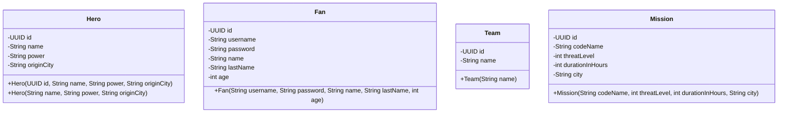

# Proyecto - HeroHub: La Agencia de Superhéroes

La ciudad necesita héroes. Los héroes necesitan misiones. Y las misiones... necesitan papeleo.

**HeroHub** es la agencia encargada de gestionar a los superhéroes de la ciudad: registrar sus poderes, asignar misiones, organizar equipos y mantener contentos a sus fanáticos. Ustedes han sido contratados como el equipo de desarrollo de la agencia. Su trabajo es construir el sistema de gestión interno de HeroHub.

A diferencia de los talleres del curso, este proyecto **no tiene una especificación completa desde el día uno**. Este documento define únicamente la primera iteración. A partir de allí, el sistema crecerá iteración tras iteración con los temas que se verán en clase, y **serán ustedes quienes propongan cómo evolucionar el software**. Si copia este enunciado en un modelo de lenguaje obtendrá, a lo sumo, la primera iteración: el resto del proyecto se diseña en el aula.

## Índice

- [Proyecto - HeroHub: La Agencia de Superhéroes](#proyecto---herohub-la-agencia-de-superhéroes)
  - [Índice](#índice)
  - [La visión: gestión de héroes y planificación estratégica](#la-visión-gestión-de-héroes-y-planificación-estratégica)
  - [¿Cómo se trabajará en este proyecto?](#cómo-se-trabajará-en-este-proyecto)
  - [Iteración 1 - Semana 9: Primeros pasos en HeroHub](#iteración-1---semana-9-primeros-pasos-en-herohub)
    - [Enunciado](#enunciado)
      - [Paquetes](#paquetes)
        - [Paquete model](#paquete-model)
        - [Clase `Hero`:](#clase-hero)
          - [Atributos](#atributos)
          - [Constructores](#constructores)
        - [Clase `Fan`](#clase-fan)
          - [Atributos](#atributos-1)
          - [Constructores](#constructores-1)
        - [Clase `Team`](#clase-team)
          - [Atributos](#atributos-2)
          - [Constructores](#constructores-2)
        - [Clase `Mission`](#clase-mission)
          - [Atributos](#atributos-3)
          - [Constructores](#constructores-3)
    - [Clases sin paquete](#clases-sin-paquete)
      - [Clase `Main`](#clase-main)
    - [Diagrama de clases inicial](#diagrama-de-clases-inicial)
    - [Prueba de que mis clases están correctamente definidas](#prueba-de-que-mis-clases-están-correctamente-definidas)
    - [Calificación de la iteración 1](#calificación-de-la-iteración-1)
  - [Hoja de ruta del proyecto](#hoja-de-ruta-del-proyecto)
  - [Calificación general](#calificación-general)
  - [Preguntas frecuentes (FAQs)](#preguntas-frecuentes-faqs)
  - [Recursos en línea](#recursos-en-línea)

## La visión: gestión de héroes y planificación estratégica

El sistema que construirán está inspirado en el minijuego de despacho del videojuego _Dispatch_: un segmento centrado en la gestión donde se asignan superhéroes a misiones con base en sus habilidades y estadísticas, equilibrando las probabilidades de éxito, la disponibilidad y los tiempos de recuperación.

Un aspecto clave del sistema es equilibrar la disponibilidad de los héroes y seleccionar la combinación correcta de habilidades. Los héroes tienen fortalezas distintas, y algunas misiones son más desafiantes que otras, lo que exige un uso creativo de sus capacidades. Las estadísticas ocultas, como la **sinergia del equipo**, añaden otra capa de complejidad: recompensan a quienes experimentan con diferentes combinaciones y se adaptan a los requisitos cambiantes de cada misión.

En definitiva, el despacho de misiones de HeroHub combina la toma de decisiones tácticas con la gestión estratégica: no basta con tener héroes poderosos, hay que saber **a quién enviar, con quién y cuándo**.

Tenga en cuenta que esta sección describe la _visión_ del producto, no su especificación. ¿Qué es exactamente una estadística? ¿Cómo se calcula la sinergia de un equipo? ¿Qué ocurre cuando un héroe está en una misión y aparece una emergencia? Esas son decisiones de diseño que los equipos propondrán y defenderán a lo largo de las iteraciones.

[Volver al índice](#índice)

## ¿Cómo se trabajará en este proyecto?

El proyecto se desarrolla en **iteraciones** que coinciden con los temas del curso. La iteración 1 está completamente definida en este documento. A partir de la iteración 2, la dinámica será la siguiente:

1. **El profesor anuncia el tema de la iteración** (por ejemplo: relaciones entre clases, excepciones, archivos, herencia).
2. **Cada equipo entrega una propuesta de diseño el lunes** (una semana antes de la entrega de la iteración). La propuesta debe explicar, como mínimo:
    - Qué clases, atributos y métodos nuevos necesita el sistema.
    - Cómo cambian las clases existentes.
    - El diagrama de clases actualizado (puede usar [mermaid](https://mermaid.js.org/syntax/classDiagram.html) o [plantuml](https://plantuml.com/class-diagram)).
    - Cómo piensa resolver las reglas de negocio del tema en curso.
3. **El miércoles, durante la clase, cada equipo socializa su propuesta** y recibe retroalimentación del profesor y de los demás equipos. El profesor puede pedir ajustes que harán parte de la calificación.
4. **El equipo implementa la iteración ajustada** y la entrega en la semana indicada.

> [!WARNING]
> Este proyecto hace parte de su nota final. Las funcionalidades incompletas de una iteración deberán corregirse, pero no impedirán que el equipo continúe con los conceptos de la siguiente. La corrección de regresiones se evaluará por separado.

[Volver al índice](#índice)

## Iteración 1 - Semana 9: Primeros pasos en HeroHub

### Enunciado

A continuación se presenta la documentación de la primera iteración del sistema de HeroHub. Va a encontrar una explicación detallada de las clases que deben existir en el proyecto.

El primer paso es descargar o clonar el proyecto de este repositorio. Luego, abrirlo en un IDE (preferiblemente IntelliJ) y empezar a trabajar en él. Recuerde que debe tener instalado Java 25.

Una vez que haya abierto el proyecto, se crearán las clases necesarias para trabajar en el proyecto. Cada una de estas clases deberá estar en el paquete que se le indique.

#### Paquetes

##### Paquete model

El paquete `model` contiene las clases que representan las entidades principales del sistema de HeroHub.
Una entidad, en el contexto de la programación y el desarrollo de software, se refiere a un objeto o concepto que es identificable.
En términos simples, una entidad es una instancia única de un objeto.
En este programa, las entidades son: `Hero`, `Fan`, `Team` y `Mission`.

[Volver al índice](#índice)

##### Clase `Hero`:

La clase `Hero` representa un superhéroe registrado en la agencia.

###### Atributos

La clase `Hero` tiene cuatro atributos:

1. `id`: Este atributo es una instancia de la clase `UUID`. Se utiliza para identificar de manera única cada instancia de `Hero`.

2. `name`: Este atributo es una cadena que representa el nombre de héroe (alias) con el que se le conoce públicamente. Por ejemplo: _"Capitán Trueno"_.

3. `power`: Este atributo es una cadena que describe el poder principal del héroe. Por ejemplo: _"Control del clima"_.

4. `originCity`: Este atributo es una cadena que representa la ciudad de origen del héroe.

###### Constructores

La clase `Hero` tiene dos constructores:

1. `public Hero(UUID id, String name, String power, String originCity)`: Este constructor crea un objeto `Hero` con el `id`, `name`, `power` y `originCity` proporcionados.

2. `public Hero(String name, String power, String originCity)`: Este constructor crea un objeto `Hero` con el `name`, `power` y `originCity` proporcionados. El `id` se genera automáticamente.

[Volver al índice](#índice)

##### Clase `Fan`

La clase `Fan` representa un fanático registrado en la plataforma de la agencia. Los fanáticos son los usuarios del sistema: siguen a sus héroes favoritos y a los equipos oficiales creados por la agencia.

###### Atributos

La clase `Fan` tiene seis atributos:

1. `id`: Este atributo es una instancia de la clase `UUID`. Se utiliza para identificar de manera única cada instancia de `Fan`.

2. `username`: Este atributo es una cadena que representa el nombre de usuario del fanático.

3. `password`: Este atributo es una cadena que representa la contraseña del fanático.

4. `name`: Este atributo es una cadena que representa el nombre del fanático.

5. `lastName`: Este atributo es una cadena que representa el apellido del fanático.

6. `age`: Este atributo es un entero que representa la edad del fanático.

###### Constructores

La clase `Fan` tendrá dos constructores, de momento se implementará solo uno de ellos:

1. `public Fan(String username, String password, String name, String lastName, int age)`: Este constructor crea un objeto `Fan` con el `username`, `password`, `name`, `lastName` y `age` proporcionados. El `id` se genera automáticamente.

[Volver al índice](#índice)

##### Clase `Team`

La clase `Team` representa un equipo de superhéroes. Piense en él como la "lista de reproducción" de la agencia: un grupo nombrado que eventualmente agrupará héroes.

###### Atributos

La clase `Team` tiene dos atributos:

1. `id`: Este atributo es una instancia de la clase `UUID`. Se utiliza para identificar de manera única cada instancia de `Team`.

2. `name`: Este atributo es una cadena que representa el nombre del equipo. Por ejemplo: _"Los Vigilantes de Medianoche"_.

###### Constructores

La clase `Team` tiene dos constructores, de momento se implementará solo uno de ellos:

1. `public Team(String name)`: Este constructor crea un objeto `Team` con el `name` proporcionado. El `id` se genera automáticamente.

[Volver al índice](#índice)

##### Clase `Mission`

La clase `Mission` representa una misión que la agencia puede asignar a sus héroes.

###### Atributos

La clase `Mission` tiene cinco atributos:

1. `id`: Este atributo es una instancia de la clase `UUID`. Se utiliza para identificar de manera única cada instancia de `Mission`.

2. `codeName`: Este atributo es una cadena que representa el nombre clave de la misión. Por ejemplo: _"Operación Eclipse"_.

3. `threatLevel`: Este atributo es un entero entre 1 y 10 que representa el nivel de amenaza estimado de la misión. La Agencia Central entregará posteriormente el nivel oficial para la ciudad.

4. `durationInHours`: Este atributo es un entero que representa la duración estimada de la misión en horas.

5. `city`: Este atributo es una cadena que representa la ciudad donde se llevará a cabo la misión.

###### Constructores

La clase `Mission` tendrá dos constructores, de momento se implementará uno de ellos:

1. `public Mission(String codeName, int threatLevel, int durationInHours, String city)`: Este constructor crea un objeto `Mission` con el `codeName`, `threatLevel`, `durationInHours` y `city` proporcionados. El `id` se genera automáticamente.

[Volver al índice](#índice)

### Clases sin paquete

#### Clase `Main`

La clase `Main` es la clase principal del sistema de HeroHub. Contiene el método `main` que se ejecuta cuando se inicia la aplicación.

El método `main` debe realizar las siguientes acciones:

1. Crear un objeto de la clase `Hero` con los datos que el usuario le indique.
2. Crear un objeto de la clase `Fan` con los datos que el usuario le indique.
3. Crear un objeto de la clase `Team` con el nombre que el usuario le indique.
4. Crear un objeto de la clase `Mission` con los datos que el usuario le indique.

En todos los casos, los datos que el usuario le indique deben ser ingresados por consola con excepción del `id` que se generará automáticamente.

[Volver al índice](#índice)

### Diagrama de clases inicial

Este es el diagrama de clases con el que arranca el proyecto. **Crecerá en cada iteración** y mantenerlo actualizado hará parte de las siguientes entregas:



Como puede darse cuenta, **ninguna de las clases está relacionada entre sí** (todavía). ¿Quién debería conocer a quién? ¿Un héroe conoce sus misiones, o la misión conoce a sus héroes? ¿Un equipo puede existir sin héroes? Esas decisiones harán parte de las próximas iteraciones... y de sus propuestas.

[Volver al índice](#índice)

### Verificación de la entrega

Este repositorio contiene el enunciado del proyecto, no un proyecto Gradle ejecutable ni pruebas automáticas. En el proyecto creado por su equipo, verifique antes de entregar que el programa compile y ejecute desde el IDE y desde Gradle, si su equipo configuró el wrapper:

```bash
./gradlew build
```

El comando solo aplica dentro del proyecto Gradle del equipo. Una compilación exitosa no garantiza que las reglas de negocio estén implementadas correctamente; pruebe también cada opción del menú.

### Calificación de la iteración 1

El programa debe compilar y ejecutar sin errores. Se debe cumplir con los siguientes requerimientos:

1. Las clases deben estar en los paquetes indicados. (0.5)
2. Las clases deben tener los atributos y constructores indicados. (1.0)
3. Todas las clases del paquete `model` deben tener getters para todos los atributos y setters para todos con excepción del atributo `id`. (1.0)
4. Todas las clases del paquete `model` deben implementar el método `toString` que devuelva una cadena de caracteres (String) con el siguiente formato (1.0):
    ```
   <Atributo1>: <Valor1> - <Atributo2>: <Valor2> ... <AtributoN>: <ValorN>
   ```
5. El programa debe solicitar los datos al usuario por consola. (0.5)
6. La clase `Main` debe permitir crear cada uno de los objetos por medio de un menú e imprimirlo en pantalla. (1.0)

> [!WARNING]
> **Este proyecto es acumulativo. Los defectos de esta iteración deben corregirse para evitar regresiones, pero el equipo podrá continuar trabajando en la siguiente.
> Esta iteración aporta 0.5 puntos al proyecto final.
> Esta iteración debe ser entregada durante la semana 9.**

[Volver al índice](#índice)

## La librería de la Agencia

HeroHub no trabaja sola: la **Agencia Central** pone a disposición de todos los equipos de desarrollo una librería oficial de Java llamada `hero-intel`. Esta librería entrega información actualizada de la agencia, como el nivel de amenaza oficial de una ciudad o la actividad villanesca reciente. Úsela con sabiduría: la información de la Agencia Central es confidencial.

Para usarla, descargue el archivo `hero-intel-1.0.0.jar` que el profesor publicará, cópielo en una carpeta `libs/` de su proyecto y agregue la dependencia en el archivo `build.gradle`:

```gradle
dependencies {
    implementation files('libs/hero-intel-1.0.0.jar')
    // ... resto de dependencias
}
```

El profesor le entregará a cada equipo un **token de acceso único, revocable y temporal**. El token identifica al equipo ante la Agencia Central y **nunca debe escribirse en el código fuente**: la librería lo lee de la variable de entorno `HERO_INTEL_TOKEN`.

- Cada equipo recibirá su propio token. **No lo comparta, no lo incluya en capturas de pantalla ni lo suba a ningún repositorio.**
- Si la Agencia detecta un uso indebido o una filtración, el token será revocado y reemplazado por el profesor.

Una vez configurada la variable de entorno, la librería se usa de la siguiente manera:

```java
IntelService intel = IntelService.create();

// Nivel de amenaza oficial de una ciudad (valor entero)
int threat = intel.getCityThreatLevel("Metrópolis");

// Actividad villanesca reciente en una ciudad
List<VillainIntel> villainActivity = intel.getVillainActivity("Metrópolis");
```

**La guía completa de instalación y configuración** (Windows y macOS, paso a paso, con solución de errores) está en [docs/hero-intel.md](docs/hero-intel.md).

Ustedes no necesitan saber _cómo_ la librería obtiene la información; ese es un asunto clasificado de la Agencia Central. Lo único que debe importarles es **dónde tiene sentido usarla en el sistema**. Por ejemplo: ¿debería la agencia permitir registrar una misión con un nivel de amenaza que contradiga el informe oficial de la ciudad? ¿Debería un fanático recibir una alerta cuando un villano aparece en su ciudad? Esas decisiones harán parte de las iteraciones siguientes y de sus propuestas.

[Volver al índice](#índice)

## Hoja de ruta del proyecto

Estas son las iteraciones del proyecto y los temas del curso con los que coinciden. Recuerde: **el detalle de cada iteración lo proponen ustedes**. Este documento solo define la iteración 1.

| Iteración | Tema del curso | Propuesta (lunes) | Socialización (miércoles en clase) | Entrega | Puntos |
|-----------|----------------|-------------------|------------------------------------|---------|--------|
| 1 | Primeros pasos en Java: clases, atributos, constructores y métodos | _Definida en este README_ | — | Semana 9 | 0.5 |
| 2 | Relaciones entre clases y principio de responsabilidad única | Lunes de la semana 10 | Miércoles de la semana 10 (taller en clase: héroes) | Miércoles de la semana 11 | 1.0 |
| 3 | Strings & Excepciones | Lunes de la semana 11 | Miércoles de la semana 12 (taller en clase) | Miércoles de la semana 12 (parte 1: módulo del fanático) y miércoles de la semana 13 (parte 2: administrador y Agencia Central) | 0.5 + 0.5 |
| 4 | Maps, Sets, archivos de texto y binarios | Lunes de la semana 14 | Miércoles de la semana 14 | Semana 15 | 1.5 |
| 5 | Herencia, polimorfismo y despacho de misiones | Lunes de la semana 16 | Miércoles de la semana 16 | Final de la semana 18 | 2.5 |

Algunas preguntas que las próximas iteraciones deberán responder (y que ustedes deberán proponer cómo resolver):

- **Iteración 2:** ¿Cómo se relacionan héroes, misiones, equipos y fanáticos? ¿Quién es responsable de crear, eliminar y listar cada entidad? ¿Qué pasa con las misiones de un héroe cuando el héroe se retira (es eliminado)? ¿Dónde vive la lista centralizada de cada entidad? ¿Quién imprime en consola y quién no?
- **Iteración 3:** ¿Cómo se autentica un fanático en la plataforma? ¿Qué validaciones aplican al nombre de usuario, la contraseña y la edad? ¿Qué excepciones propias necesita HeroHub y con qué mensajes exactos? ¿Qué operaciones puede hacer un fanático y cuáles son exclusivas del administrador? ¿Qué le dice la Agencia Central a la agencia al momento de registrar una misión?
- **Iteración 4:** ¿Cómo se importan los datos iniciales desde archivos de texto? ¿Cómo se guarda y se reanuda el estado actual en binario? ¿Qué estructura tendrán los archivos? ¿Qué estadísticas describen a un héroe? ¿Cómo se reconstruyen relaciones por id y se generan reportes útiles?
- **Iteración 5:** ¿Cómo cambia el comportamiento de un héroe según su rango? ¿Cómo se despacha un equipo mediante la Agencia Central? ¿Cómo se ganan experiencia, niveles y puntos de habilidad? ¿Qué ocurre con lesiones, descansos y muertes? ¿Cómo funcionan la sinergia, los ascensos, los villanos y la progresión del despachador? ¿Cómo se reanuda una partida sin aplicar dos veces el mismo desenlace?

[Volver al índice](#índice)

## Calificación general

El proyecto suma en total **6.5 puntos** distribuidos en las iteraciones de la hoja de ruta. Para cada iteración se tendrá en cuenta:

1. Que el programa compile y ejecute sin errores.
2. Que se respete la separación de responsabilidades acordada en la propuesta.
3. Que la propuesta haya sido entregada en la fecha indicada y socializada en clase.
4. Que los ajustes pedidos por el profesor en la socialización hayan sido aplicados.
5. Que las funcionalidades de las iteraciones anteriores sigan funcionando.

Los requerimientos funcionales los validará el cliente (monitor), mientras que el código y las decisiones de diseño los revisará el profesor.

Aunque los requerimientos se cumplan, el profesor puede indicarle cambios que debe hacer en el código, que serán evaluados en la siguiente iteración.

Si una entrega queda incompleta, el profesor indicará el conjunto mínimo de correcciones o una base compatible para que el equipo pueda continuar. Las nuevas competencias de la siguiente iteración sí se evaluarán; las regresiones pendientes se registrarán como un criterio independiente.

[Volver al índice](#índice)

## Preguntas frecuentes (FAQs)

**¿Qué es el despacho de misiones en HeroHub?**
Es el corazón del sistema: la funcionalidad donde la agencia asigna superhéroes a misiones con base en sus habilidades y estadísticas, equilibrando las probabilidades de éxito, la disponibilidad de los héroes y los tiempos de recuperación entre misiones.

**¿Qué tipos de misiones existen en HeroHub?**
Las misiones varían desde tareas sencillas, como rescatar una mascota atrapada en un árbol, hasta situaciones de alto estrés como negociaciones con rehenes o investigaciones de fenómenos paranormales. El catálogo exacto de misiones y sus niveles de amenaza se definirán a lo largo de las iteraciones (y la Agencia Central tendrá algo que decir al respecto).

**¿Las decisiones de asignación afectan el resultado?**
Sí. Las decisiones de la agencia influyen en el éxito de las misiones, en las relaciones entre los héroes y en la reputación de HeroHub ante sus fanáticos. Y algo más serio: un escuadrón mal elegido puede significar que un héroe no vuelva a casa.

**¿Hay elementos de RPG o de simulación en el sistema?**
Sí. Los héroes tienen estadísticas y bonificaciones de sinergia ocultas que afectan el desempeño de las misiones, lo que crea una mezcla de gestión táctica y narrativa.

**¿Y cómo se implementa todo esto?**
Esa es, precisamente, la pregunta que cada equipo deberá responder con sus propuestas, iteración tras iteración. Este README define únicamente el punto de partida; el diseño completo del despacho de misiones se construye (y se defiende) en el aula.

[Volver al índice](#índice)

## Recursos en línea

- [Instalar Java 22 o versiones anteriores en Windows mediante Temurin](https://www.youtube.com/watch?v=nFTsq8Q3Q-o) [Video]
- [Cómo instalar y desinstalar el JDK de Java 22 en macOS](https://www.youtube.com/watch?v=47AeOQJCV6s) [Video]
- [¿Para qué sirve el modificador static de Java?](https://www.youtube.com/watch?v=044vXkXypcU) [Video]
- [Getters y setters o atributos públicos en Java, ¿qué es mejor?](https://www.youtube.com/watch?v=gXvnHialu0s) [Video]
- [toString en Java ☕ Viendo el estado de los objetos 👀](https://www.youtube.com/watch?v=r9rxz63p4XQ) [Video]
- [Introducción al Scanner de Java](https://www.youtube.com/watch?v=nvHVzPfdrAQ) [Video]
- [Mermaid Class Diagrams](https://mermaid.js.org/syntax/classDiagram.html) [Documentación]
- [Java Data Types](https://www.geeksforgeeks.org/data-types-in-java/) [Artículo]
- [Java OOP Concepts](https://www.geeksforgeeks.org/object-oriented-programming-oops-concept-in-java/) [Artículo]
- [Java Constructors](https://www.geeksforgeeks.org/constructors-in-java/) [Artículo]
- [Package in Java](https://www.geeksforgeeks.org/packages-in-java/) [Artículo]
- [Java null](https://www.baeldung.com/java-null) [Artículo]

[Volver al índice](#índice)
